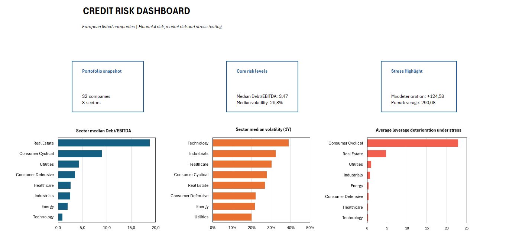
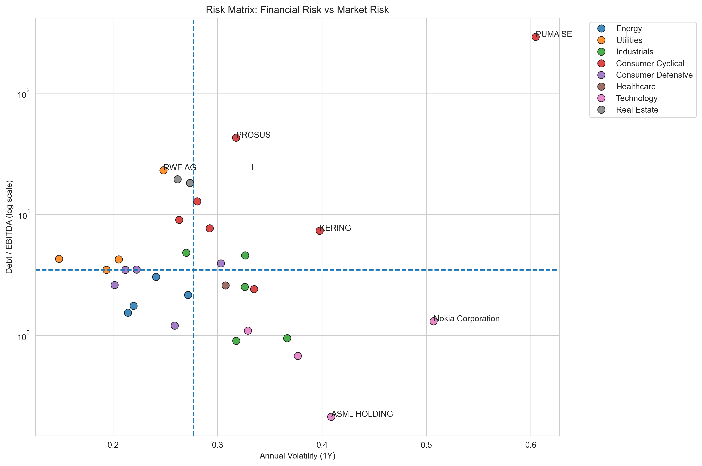
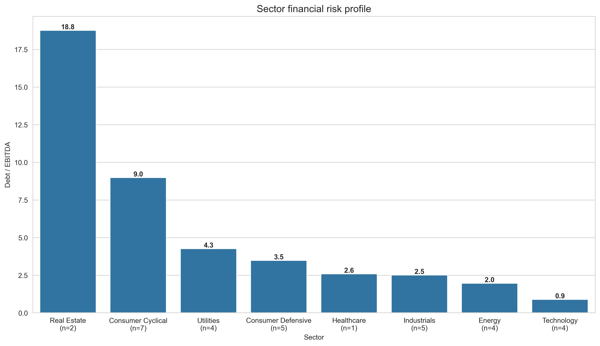

# Credit Risk Stress Testing of European Listed Companies

A Python-based credit risk analysis project focused on a selected sample of European listed companies, combining financial ratios, market risk indicators, and sector-level stress testing.

<p align="center">
  
</p>

## Project Overview

This project was developed as a personal portfolio project to demonstrate analytical skills relevant to **Risk Management** and **Credit Risk** roles.

The objective is to build an end-to-end workflow that starts from publicly available company data and transforms it into a structured credit risk assessment framework. The analysis combines accounting-based metrics, market-based indicators, and a recession-style stress testing exercise in order to identify weaker corporate profiles and compare risk across sectors.

The project is designed not only as a coding exercise, but also as a reporting and communication tool, with outputs that can be presented through charts, ranked tables, and an Excel dashboard.

## Objectives

The main objectives of the project are:

- assess the baseline financial risk profile of selected European corporates;
- complement balance-sheet indicators with market risk signals;
- simulate the effect of an adverse macroeconomic scenario through sector-specific EBITDA shocks;
- identify the companies most exposed to leverage deterioration under stress;
- produce clear and interpretable outputs suitable for analytical reporting.

## Dataset

The dataset was built using publicly available information retrieved through `yfinance`.

For each company, the project collects:
- Ticker
- Company name
- Sector
- Country
- Market Capitalization
- Total Debt
- Revenue
- EBITDA

The final enriched dataset includes the following derived variables:
- `Debt_to_EBITDA`
- `EBITDA_Margin`
- `Debt_to_Revenue`
- `Volatility_1Y`
- `Max_Drawdown_1Y`
- `sector_shock`
- `Stress_EBITDA`
- `Stress_Debt_to_EBITDA`
- `Debt_EBITDA_change`

## Methodology

The project is structured into four main analytical steps.

### 1. Data Collection and Cleaning

Company-level data are retrieved through `yfinance` and stored in a raw dataset. The dataset is then cleaned by converting relevant fields into numeric format, removing incomplete observations, and standardizing company names where needed.

### 2. Financial Risk Analysis

The first analytical layer focuses on three accounting-based metrics:

- **Debt-to-EBITDA**, used as a leverage proxy;
- **EBITDA Margin**, used to measure operating profitability;
- **Debt-to-Revenue**, used to assess debt burden relative to company scale.

These variables provide a first view of balance-sheet pressure and earnings resilience across the sample.

### 3. Market Risk Analysis

The second layer enriches the dataset with market-based indicators derived from one year of stock price data:

- **Volatility_1Y**, calculated from daily returns and annualized;
- **Max_Drawdown_1Y**, calculated as the largest peak-to-trough decline over the period.

These metrics make it possible to compare accounting fragility with market-implied instability.

### 4. Stress Testing

A simplified recession scenario is applied by introducing sector-specific EBITDA shocks:

- Consumer Cyclical: 30%
- Technology: 25%
- Industrials: 20%
- Real Estate: 20%
- Energy: 15%
- Consumer Defensive: 10%
- Utilities: 10%
- Healthcare: 10%

The stressed scenario is implemented as follows:

```python
Stress_EBITDA = EBITDA * (1 - sector_shock)
Stress_Debt_to_EBITDA = TotalDebt / Stress_EBITDA
Debt_EBITDA_change = Stress_Debt_to_EBITDA - Debt_to_EBITDA
```

This framework makes it possible to estimate how leverage would deteriorate if operating earnings were compressed under adverse sector conditions.

## Key Outputs

The project produces four main outputs:

- **Financial Risk Analysis**, based on leverage, profitability, and debt burden metrics;
- **Market Risk Analysis**, based on volatility and maximum drawdown;
- **Stress Test Ranking**, highlighting the companies most exposed to leverage deterioration;
- **Dashboard-ready final dataset**, integrating financial, market, and stressed variables.

### Risk Matrix

The risk matrix compares baseline financial leverage and market volatility, helping identify firms that combine accounting fragility with unstable market behavior.

<p align="center">
  
</p>

### Sector Financial Risk Profile

The sector chart summarizes the median Debt-to-EBITDA ratio across sectors and highlights where leverage is structurally more elevated.

<p align="center">
  
</p>

### Top 10 Stressed Companies

The final stress-test ranking identifies the companies with the largest increase in Debt-to-EBITDA under the recession scenario.

| Rank | Company | Sector | Debt-to-EBITDA | Stressed Debt-to-EBITDA | Change |
|------|---------|--------|---------------:|------------------------:|-------:|
| 1 | Puma | Consumer Cyclical | 290.68 | 415.26 | 124.58 |
| 2 | Prosus | Consumer Cyclical | 22.21 | 31.73 | 9.52 |
| 3 | Volkswagen | Consumer Cyclical | 12.77 | 18.24 | 5.47 |
| 4 | LEG Immobilien | Real Estate | 19.44 | 24.30 | 4.86 |
| 5 | Vonovia | Real Estate | 18.09 | 22.62 | 4.52 |
| 6 | Mercedes-Benz | Consumer Cyclical | 8.98 | 12.83 | 3.85 |
| 7 | BMW | Consumer Cyclical | 7.65 | 10.93 | 3.28 |
| 8 | Kering | Consumer Cyclical | 7.30 | 10.43 | 3.13 |
| 9 | RWE | Utilities | 23.06 | 25.62 | 2.56 |
| 10 | Volvo | Industrials | 4.81 | 6.01 | 1.20 |

## Dashboard

The final dataframe was also used to create an Excel dashboard aimed at presenting the analysis in a more business-oriented and visual format.

The dashboard is designed to summarize:
- company and sector-level KPIs;
- baseline financial risk indicators;
- market risk indicators;
- stressed leverage metrics

This reporting layer extends the project from pure analysis to presentation and communication, which is particularly relevant in risk management contexts.

## Repository Structure

```bash
Credit-Risk-stress-testing/
│
├── Data_collection.py
├── Risk_analysis.py
├── Market_metrics.py
├── Stress-test.py
├── Visualization.py
├── README.md
│
├── data/
│   ├── raw/
│   └── processed/
│
├── Outputs/
│   ├── figure/
│   └── table/
│
└── images/
    ├── dashboard_overview.png
    ├── risk_matrix.png
    └── sector_risk.png
```

## How to Run

1. Clone the repository:

```bash
git clone https://github.com/fciancio23/Credit-Risk-stress-testing.git
cd Credit-Risk-stress-testing
```

2. Install the required Python libraries:

```bash
pip install pandas numpy matplotlib seaborn yfinance
```

3. Run the scripts in the following order:

```bash
python Data_collection.py
python Risk_analysis.py
python Market_metrics.py
python Stress-test.py
python Visualization.py
```

## Main Findings

Some of the key findings of the project are:

- financial risk is highly heterogeneous across the sample;
- Technology and part of the Energy sector display more conservative leverage profiles;
- Consumer Cyclical and Real Estate emerge as the most vulnerable sectors under both baseline and stressed conditions;
- market risk does not always perfectly match accounting risk, but it often reinforces already fragile profiles;
- the stress test shows that companies with weak starting leverage and high sector sensitivity experience the strongest deterioration.

## Limitations

This project is intentionally simplified and should be interpreted as an analytical framework rather than as a full institutional credit model.

Main limitations include:
- reliance on publicly available `yfinance` data;
- a relatively small and selected company sample;
- deterministic sector stress assumptions;
- an EBITDA-focused stress methodology;
- no explicit treatment of liquidity, interest expense, debt maturities, or refinancing risk.

## Future Improvements

Potential future extensions include:

- expanding the company universe;
- adding metrics such as interest coverage, net debt, or cash flow indicators;
- introducing multiple stress scenarios and sensitivity analysis;
- making the dashboard more interactive;
- migrating the final reporting layer to Power BI or Streamlit.

## Author

**Francesco Samuele Ciancio**

Personal portfolio project developed for applications in risk management and credit risk.
